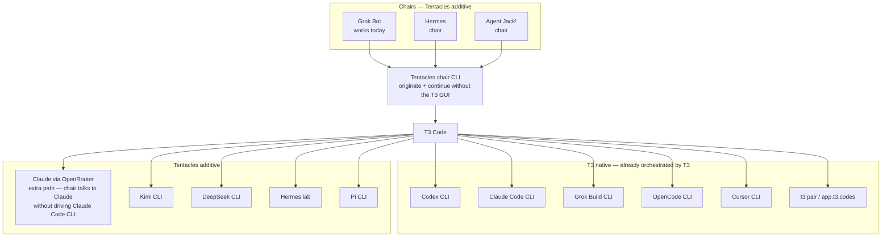
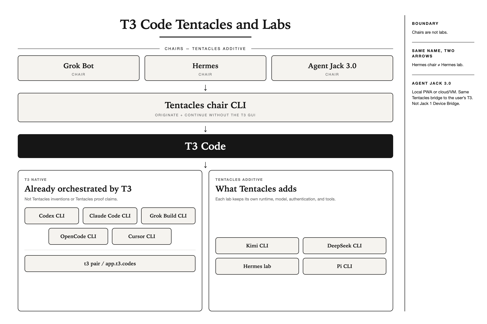

# T3 Code Tentacles and Labs

Tentacles is an additive bridge for [T3 Code](https://github.com/pingdotgg/t3code).
It gives chair CLIs a way to originate and continue T3 work without the GUI,
adds adapters that T3 does not ship, and provides a Claude-via-OpenRouter path
so a chair can talk to Claude without driving the T3-native Claude Code CLI.
The public command is `tentacles`; `t3-agent-bridge` is an exact compatibility
alias.

T3 Code already orchestrates Codex CLI, Claude Code CLI, Grok Build CLI, OpenCode CLI,
and Cursor CLI, plus its own `t3 pair` / `app.t3.codes` remote path. Those are
T3-native capabilities, not Tentacles inventions or Tentacles proof claims.

[](https://github.com/m-check1B/t3-code-tentacles/actions/workflows/ci.yml)
[](https://github.com/m-check1B/t3-code-tentacles/releases)
[](LICENSE)
[](package.json)

Repository documentation and integration authority boundaries start at
[docs/README.md](docs/README.md).
This project is released under the permissive [MIT License](LICENSE).

## Use Tentacles

Clone the public repository and link the command:

```bash
git clone https://github.com/m-check1B/t3-code-tentacles.git
cd t3-code-tentacles
npm link
```

Give your chair the copyable Operate Tentacles skill at
[`integrations/tentacles-operate-skill/SKILL.md`](integrations/tentacles-operate-skill/SKILL.md),
then ask it to operate Tentacles. The skill tells the chair to run doctor,
choose an advertised instance and model, set a thought budget, originate with
`--runtime-mode full-access`, continue with `runtimeMode: full-access`, observe,
and stop the thread safely.

If the chair loads skills from a filesystem directory, link the whole
`integrations/tentacles-operate-skill` folder into that configured directory as
`tentacles-operate`. Do not replace an existing skill path without inspecting
it first.

```bash
tentacles doctor
tentacles originate \
  --workspace "$PWD" \
  --title "Tentacles quick start" \
  --message "Start this work and report the result." \
  --instance grok \
  --model grok-4.6 \
  --budget high \
  --runtime-mode full-access
tentacles act --intent '{"action":"thread.continue","threadId":"<thread-id>","text":"Continue with the next concrete step.","runtimeMode":"full-access"}'
```

## Start here: what T3 ships and what Tentacles adds

A **chair** operates T3 Code through the Tentacles chair CLI. Grok Bot already
uses this path; Hermes and Agent Jack use the same contract. Chairs are not
labs. Hermes as a chair and Hermes as a lab are two different arrows and two
different proof claims.

```text
                    CHAIRS — TENTACLES ADDITIVE

              [Grok Bot]   [Hermes]   [Agent Jack 1]
                    \          |          /
                     +-- [Tentacles chair CLI] --+
                         originate + continue
                          without the T3 GUI
                                  |
                              [T3 Code]
                                  |
                   +--------------+--------------+
                   |                             |
       T3 NATIVE — already                 TENTACLES ADDITIVE
        orchestrated by T3
                   |                             |
 [Codex CLI] [Claude Code CLI]       [Claude via OpenRouter]
 [Grok Build CLI] [OpenCode CLI]     extra path: chair talks to Claude
 [Cursor CLI]                         without driving Claude Code CLI
 [t3 pair / app.t3.codes]
                                      [Kimi CLI] [DeepSeek CLI]
                                      [Hermes lab] [Pi CLI]
```





<sup>1</sup> **Jack local/cloud footnote.** Local Jack is an installable web app
(PWA) in the user's browser and uses Tentacles to reach T3 on that machine—no
Electron and no Jack 1 Device Bridge dashboard. Cloud Jack runs on Blaxel or
another VM while the user works in a browser; it uses the same Tentacles bridge
to reach the user's T3 on one or more computers. A cloud route still requires
its remote connection and pairing to be installed and configured.

The additive lab adapters are Kimi CLI, DeepSeek CLI, Hermes lab, and Pi CLI.
The separate Claude-via-OpenRouter path lets a chair talk to Claude without
driving the T3-native Claude Code CLI; it does not replace that native lab.
Each lab keeps its own runtime, model, authentication, and tools.

## Quick start

After meeting the [prerequisites and issuing a local T3 token](#five-minute-setup),
install the command, inspect this machine, and originate only a lab that doctor
marks `ready`:

```bash
git clone https://github.com/m-check1B/t3-code-tentacles.git
cd t3-code-tentacles
npm link
tentacles doctor
tentacles originate \
  --workspace "$PWD" \
  --title "Tentacles quick start" \
  --message "Start a ready Grok lab." \
  --instance grok \
  --runtime-mode full-access
```

Continue the returned thread with the same required runtime mode:

```bash
tentacles act --intent '{"action":"thread.continue","threadId":"<id>","text":"continue","runtimeMode":"full-access"}'
```

Every originate and every non-empty continue must remain `full-access`. Doctor
is this-machine truth; advertised does not mean proved.

> **Project status:** early macOS integration with Node.js 22 and T3 Code 0.0.34.
> `tentacles doctor` prints the live lab matrix for *your* machine. Treat that
> output as local truth. The proof table below is this project's e2e record, not
> a promise that the same labs are ready on a fresh clone.

## Native versus additive matrix

`tentacles doctor` is the source of truth for this machine. It prints a table of
advertised labs (`ready` / `installed` / `explicit`) and never prints tokens,
auth headers, or provider secrets. Use `tentacles doctor --json` for the
machine-readable document. Doctor inventories both T3-native providers and
Tentacles adapters; appearing in doctor does not transfer product ownership.

T3-native reference rows:

| T3-native lab | Tentacles relationship |
|---|---|
| Codex CLI | T3 ships it; a chair may select it through the Tentacles chair CLI |
| Claude Code CLI | T3 ships it; distinct from the additive OpenRouter path |
| Grok Build CLI | T3 ships it; Grok Bot remains a chair, not this lab |
| OpenCode CLI | T3 ships it |
| Cursor CLI | T3 ships it |
| `t3 pair` / `app.t3.codes` | T3 ships this native remote path |

Tentacles-additive rows:

| Additive path | Default originate model | Setup |
|---|---|---|
| Claude via OpenRouter | `anthropic/claude-3-haiku` | Extra path through a distinct `claude-openrouter` adapter so a chair can talk to Claude without driving Claude Code CLI |
| Kimi CLI | `moonshotai/kimi-k3` | Kimi CLI; its settings may use OpenRouter, a Kimi plan, or another configured route |
| DeepSeek CLI | `deepseek/deepseek-v4-flash` | DeepSeek CLI; its settings may use OpenRouter, a DeepSeek plan, or another configured route |
| Hermes lab | `openai-codex:gpt-5.6-sol` | `tentacles install-provider` |
| Pi CLI | `gpt-5.6-terra` | `tentacles install-pi-provider` |

**Advertised is not proved.** Doctor `ready` means T3 currently reports that
instance as ready on this host. It is not a compatibility certificate.

### Tentacles-additive proof status (this machine, 2026-08-29)

Originate + continue with `runtimeMode: full-access`. A fail-closed result proves
the safety boundary, not a working assistant. T3-native CLI availability is
intentionally not counted as a Tentacles lab proof.

| Additive path | E2E | Notes |
|---|---|---|
| Chair CLI | Proved from Grok Bot | Originate + continue without the T3 GUI; the selected Grok CLI lab remains T3-native |
| Claude via OpenRouter | Proved | Fresh `claude-openrouter` originate + non-empty continue answered on `anthropic/claude-3-haiku`; T3-native Claude Code is not counted |
| Kimi CLI | Proved | Fresh Kimi CLI originate + non-empty continue answered through OpenRouter on `moonshotai/kimi-k3` |
| DeepSeek CLI | Proved | Fresh DeepSeek CLI originate + non-empty continue answered through OpenRouter on `deepseek/deepseek-v4-flash`; no official DeepSeek key was used |
| Hermes lab | Fail-closed proved; assistant blocked | Live `openai-codex:gpt-5.6-sol` returned the named `provider_identity_mismatch` error instead of falling through to DeepSeek; no assistant answer is claimed |
| Pi CLI | Proved | Human-approved OpenAI-Codex OAuth re-login, then fresh Pi originate + non-empty continue answered on `gpt-5.6-terra` |

Every originate and every non-empty continue must pass
`--runtime-mode full-access` / `"runtimeMode":"full-access"`. An omitted runtime
mode fails closed.

## What works today

| Flow | Result | Status |
|---|---|---|
| `tentacles doctor` | Human-readable lab matrix for this machine; `--json` for the document | Tested |
| Chair CLI → T3 thread | Grok Bot uses `tentacles originate` without the T3 GUI | Proved; the selected Grok CLI remains T3-native |
| Chair CLI continues thread | `tentacles act` `thread.continue` with `runtimeMode: full-access` | Proved from Grok Bot |
| T3 Code → Hermes / Pi / DeepSeek / Kimi | Adapter appears as a T3 provider over ACP when installed | Install path exists; live assistant proof is blocked where the table says blocked |
| Any T3 thread → Hermes | A new `@hermes` message routes to one linked Hermes thread | Requires an armed watcher **and** an answering Hermes lab |
| Existing T3 providers | Provider install/remove preserves unrelated instances | Tested |
| Background routing | Reversible per-user macOS LaunchAgent or Linux systemd user unit | macOS tested; Linux unit-tested, not live-verified |
| Inline Hermes reply in another provider's thread | Requires an upstream T3 extension point | Not available |

The mention bridge deliberately creates a clearly labeled linked Hermes thread.
It does not impersonate the assistant inside another provider's existing thread.

## Five-minute setup

### 1. Prerequisites

- T3 Code 0.0.34-nightly.20260811.1064 listening on `127.0.0.1:3773`.
- Node.js 22+.
- At least one T3 lab you can already use in the T3 UI (Grok, Codex, OpenCode,
  or Cursor). Adapter labs (Hermes, Pi, DeepSeek, Kimi) are optional and listed
  after the first originate.

Clone Tentacles and install the command shims:

```bash
git clone https://github.com/m-check1B/t3-code-tentacles.git
cd t3-code-tentacles
mkdir -p ~/.local/bin
for cmd in tentacles t3-agent-bridge; do
  dest="$HOME/.local/bin/$cmd"
  if [ -e "$dest" ] || [ -L "$dest" ]; then
    printf 'Refusing to replace existing path: %s\n' "$dest" >&2
  else
    ln -s "$PWD/bin/t3-agent-bridge" "$dest"
  fi
done
unset cmd dest
```

Ensure `~/.local/bin` is on your `PATH`. The former `t3-hermes` command remains
packaged as an exact compatibility alias. Existing ownership markers, LaunchAgent
labels, and `~/.local/state/t3-hermes-bridge` paths also remain valid so upgrades
do not silently orphan provider or watcher state.

### 2. Issue a local T3 token

Create a scoped bearer file without printing the token:

```bash
install -d -m 700 ~/.local/state/t3-hermes-bridge
umask 077
npx -y t3@0.0.34-nightly.20260811.1064 auth session issue \
  --base-dir ~/.t3 \
  --ttl 30d \
  --label t3-hermes-bridge \
  --subject local:t3-hermes-bridge \
  --token-only > ~/.local/state/t3-hermes-bridge/t3.token
chmod 600 ~/.local/state/t3-hermes-bridge/t3.token
```

The bridge accepts only an owner-controlled regular `0600` token file and only
connects to loopback T3/Hermes origins.

### 3. Read your lab matrix

```bash
tentacles doctor
```

Doctor prints advertised, enabled, installed, ready, and default model for each
lab on this machine. Originate a lab that doctor marks `ready`. Cursor is
explicit: it must already be enabled in T3, and originate needs `--model`.

### 4. Originate a ready lab

```bash
tentacles originate \
  --workspace "$PWD" \
  --title "Tentacles originated this" \
  --message "This T3 thread originated through Tentacles." \
  --instance grok \
  --runtime-mode full-access
```

Pass `--instance` for a lab doctor marks ready. A new thread should appear in
T3 Code. Continue it with:

```bash
tentacles act --intent '{"action":"thread.continue","threadId":"<id>","text":"continue","runtimeMode":"full-access"}'
```

Cursor example, after T3 Cursor is enabled and doctor shows it ready:

```bash
tentacles originate \
  --workspace "$PWD" \
  --title "Tentacles originated Cursor" \
  --message "Cursor tentacle." \
  --instance cursor \
  --model composer-2.5 \
  --runtime-mode full-access
```

Replace `composer-2.5` with a model T3 currently advertises for Cursor. Tentacles
does not install, enable, or select Cursor by default.

POL-036/POL-GB-016 mandate `--runtime-mode full-access` on every originate
and `"runtimeMode":"full-access"` on every non-empty continue, for every lab
and effort; an omitted runtime mode is refused, never defaulted.

## Optional adapters

Skip this section until a native lab originates. These harnesses are advertised;
they are not claimed green in the proof table above.

### Hermes

Choose your Hermes profile and the T3 model identifier you want displayed. The
defaults are `default` and the model used by the tested setup:

```bash
tentacles install-provider \
  --profile default \
  --model openai-codex:gpt-5.6-sol
tentacles doctor
```

If your installation exposes a different model identifier, pass it with
`--model` or set `T3_HERMES_MODEL`.

Open T3 Code, select the **Hermes** provider, and send a message. A real Hermes
assistant reply is the first-direction proof. The proxy rejects a missing Codex
credential with `codex_auth_missing`. It also pins the requested provider
identity across ACP initialization, model selection, prompt dispatch, and
continue. The 2026-08-29 live fail-closed check returned
`provider_identity_mismatch` for `openai-codex:gpt-5.6-sol` instead of emitting
DeepSeek fallback text. That proves the safety boundary; it does not prove an
answering Hermes assistant, so keep the assistant path blocked until the named
provider can answer originate and continue.

### Pi

Authenticate and configure Pi through Pi's normal local setup first. Credentials
remain in Pi's custody and are never copied into T3 settings or this bridge.
Then register the model that T3 should select initially:

```bash
tentacles install-pi-provider \
  --instance pi \
  --pi-provider openai-codex \
  --model gpt-5.6-terra
```

Open T3 Code and select **Pi**. The Pi ACP session advertises only models owned
by the configured Pi provider—three Codex models for `openai-codex` in the
tested setup. T3's model picker sends the selected bare model ID to Pi with
`session/set_model`. The compatibility relay normalizes Pi 0.1.x's legacy ACP
model/mode state and local-auth handshake. Prompts, streamed updates, tool
calls, approvals, cancellation, and model switching otherwise pass unchanged.

If a pre-v0.2 Pi installation already populated T3 with cross-provider models,
quit T3, move `~/.t3/caches/pi.json` to a private backup, reopen T3, and rerun
`install-pi-provider`. Current T3 nightly builds retain previously discovered
models across refreshes, so changing the relay alone cannot prune that stale
cache in place. Fresh v0.2 installations do not populate it.

On this machine Pi 0.1.23 was re-authenticated through its human-approved
OpenAI-Codex OAuth flow on 2026-08-29. Tentacles doctor then reported Pi ready,
and a fresh `gpt-5.6-terra` originate plus non-empty continue both answered with
`runtimeMode: full-access`. A future invalidated refresh still requires a human
to run Pi's `/login openai-codex` flow; Tentacles never handles those credentials.

### Adapter settings: Claude route, Kimi CLI, and DeepSeek CLI

**OpenRouter credential.** Claude, Kimi, and DeepSeek share one owner-controlled
runtime credential at
`~/.local/state/t3-hermes-bridge/openrouter.token`. The file must be owned by
the current user, mode `0600`, a regular file, and not a symlink. Tentacles
reads it only at adapter startup and passes it only through the child
environment; it is never stored in T3 settings, argv, doctor output, or this
repository.

**DeepSeek CLI.** This checkout's default settings route uses OpenRouter's
OpenAI-compatible endpoint and fails closed if the owner-only token file is
absent:

```bash
npm i -g dsh-acp
tentacles install-deepseek-provider \
  --instance deepseek \
  --model deepseek/deepseek-v4-flash
```

The default model is `deepseek/deepseek-v4-flash`; override it with `--model` or
`T3_DEEPSEEK_MODEL`. The wrapper launches `dsh-acp` from `PATH` (or an absolute
`--dsh-acp-bin`/`DSH_ACP_BIN` override) with a bridge-owned Cordis config and
`workspace-write` permissions. Sessions persist under
`~/.dsh/acp-sessions/<workspace-hash>`: dsh-acp's SQLite session store is
single-process, so the bridge keys the store on a digest of the working
directory T3 spawned the thread with—sessions stay resumable per workspace
while parallel T3 threads in different workspaces each get their own store.
An explicit `DSH_SESSIONS_ROOT` replaces this default entirely and must then
be unique per concurrent lane.

**Kimi CLI.** This checkout's default settings route starts Kimi's native ACP
mode against OpenRouter's OpenAI-compatible endpoint:

```bash
tentacles install-kimi-provider \
  --instance kimi \
  --model moonshotai/kimi-k3
```

**Claude via OpenRouter.** This is a separate Tentacles adapter that lets a
chair talk to Claude without driving T3's native Claude Code CLI. It does not
replace or change the normal Claude Code path. The adapter uses the bridge-owned
`dsh-acp` compatibility transport with an 8,192-token output cap, which stays
below Claude 3 Haiku's OpenRouter context window:

```bash
tentacles install-claude-openrouter-provider \
  --instance claude-openrouter \
  --model anthropic/claude-3-haiku
```

Remove registrations with the matching `remove-deepseek-provider`,
`remove-kimi-provider`, or `remove-claude-openrouter-provider` command. Each
instance carries its own ownership marker and the same foreign-instance refusal
rules as the Hermes and Pi providers. A doctor `ready` row still does not replace
an authenticated originate + continue proof.

## Optional: `@hermes` mention routing

Requires an answering Hermes lab. Skip it while the Hermes assistant path is
blocked.

```bash
tentacles watch --once --allow-all-projects   # arms the initial watermark
tentacles watch --allow-all-projects          # polls for new mentions
```

In any non-Hermes T3 thread, send `@hermes investigate this`. The watcher creates
or continues one linked `[Hermes]` thread. The first pass never backfills old
messages.

On macOS, keep the watcher running as a per-user service. Service operations
require both a filesystem-safe Hermes profile and a bridge instance so the
command cannot accidentally replace a different watcher:

```bash
tentacles install-service \
  --profile default \
  --instance hermes \
  --model openai-codex:gpt-5.6-sol \
  --interval 2000 \
  --t3-url http://127.0.0.1:3773 \
  --hermes-url http://127.0.0.1:8642 \
  --token-file ~/.local/state/t3-hermes-bridge/t3.token \
  --state-file ~/.local/state/t3-hermes-bridge/profiles/default/instances/hermes/bridge-state.json \
  --max-messages 10 \
  --allow-all-projects
tentacles service-status --profile default --instance hermes
```

`install-service` snapshots the bridge runtime into private Application Support
storage before activation. The LaunchAgent uses that immutable snapshot rather
than the mutable checkout, and contains only non-secret settings: profile,
instance, model, polling/routing policy, loopback origins, and token/state file
paths. It never stores a bearer value, auth header, WebSocket ticket, or routed
prompt.

Mention routing is deny-by-default. `--allow-all-projects` is the explicit local
policy used when every non-Hermes T3 project may summon this Hermes instance.
The library also accepts project/provider allowlists for narrower embedders.

The service uses no public, unbounded stdout/stderr logs. Instead it keeps a
private structured watcher status file and reports its freshness, state-file
freshness, token-file metadata (without reading the bearer), launchd PID/runs/
last-exit data when available, and runtime identity through `service-status`.

```bash
tentacles restart-service --profile default --instance hermes
tentacles uninstall-service --profile default --instance hermes
```

Uninstall removes only the owned namespaced LaunchAgent. It deliberately
preserves the token, routing state, private status, and immutable runtime
snapshot for recovery and audit. Existing pre-namespaced v0.1 services are
reported as migration information and are never deleted implicitly; install a
new namespaced service, verify it, then remove the old owned service manually
when you are ready. A legacy routing state is likewise preserved; pass its path
explicitly as `--state-file` only when intentionally migrating that watcher.
The bridge atomically upgrades replay-safe v0.1.0 state before dispatch. It
refuses to migrate unresolved legacy pending deliveries so they can be audited
with v0.1.0 rather than silently dropped.

### Linux: run the watcher as a systemd user service

On Linux, the same service commands install a per-user systemd unit instead of
a LaunchAgent:

```bash
tentacles install-service \
  --profile default \
  --instance hermes \
  --model openai-codex:gpt-5.6-sol \
  --interval 2000 \
  --t3-url http://127.0.0.1:3773 \
  --hermes-url http://127.0.0.1:8642 \
  --token-file ~/.local/state/t3-hermes-bridge/t3.token \
  --state-file ~/.local/state/t3-hermes-bridge/profiles/default/instances/hermes/bridge-state.json \
  --max-messages 10 \
  --allow-all-projects
tentacles service-status --profile default --instance hermes
```

Install writes the owned, private unit to
`~/.config/systemd/user/<label>.service`, links it from
`~/.config/systemd/user/default.target.wants/` (the same effect as
`systemctl --user enable`), runs `systemctl --user daemon-reload`, and starts
it. The immutable runtime snapshot and service/status files live under
`~/.local/share/t3-hermes-bridge`, with the same ownership markers and
non-secret content policy as the macOS LaunchAgent.

launchd semantics map onto systemd as follows: `KeepAlive` →
`Restart=always`, `ThrottleInterval` (10 s) → `RestartSec=10`, and the
`[Unit]` directives `StartLimitIntervalSec=0` plus `StartLimitBurst=0`
disable systemd's default start-burst limit so the restart policy remains
the only retry governor. `service-status` reads
`systemctl --user status` and `systemctl --user show`, reporting the same
shape as macOS with the restart count (`NRestarts`) mapped to launchd's runs
counter and `ExecMainStatus` to the last exit code.

```bash
tentacles restart-service --profile default --instance hermes
tentacles uninstall-service --profile default --instance hermes
```

Uninstall removes only the owned namespaced unit and enable link, and preserves
the token, routing state, private status, and immutable runtime snapshot for
recovery and audit, exactly like macOS. No bearer value, auth header, WebSocket
ticket, or routed prompt is ever written to the unit.

> **Status:** the systemd path is unit-tested against synthetic `systemctl`
> fixtures but has not yet been live-verified on a real Linux host. User units
> also only start at login unless lingering is enabled for the account
> (`loginctl enable-linger <user>`). Both remain to be proven on a target
> distribution before production use.

## Optional Hermes skill

Expose thread origination to a Hermes profile:

```bash
mkdir -p ~/.hermes/profiles/default/skills
t3_bridge_skill="$HOME/.hermes/profiles/default/skills/t3-code-bridge"
if [ -e "$t3_bridge_skill" ] || [ -L "$t3_bridge_skill" ]; then
  printf 'Refusing to replace existing path: %s\n' "$t3_bridge_skill" >&2
else
  install -d -m 700 "$t3_bridge_skill"
  install -m 600 \
    "$PWD/integrations/hermes-skill/SKILL.md" \
    "$t3_bridge_skill/SKILL.md"
  printf '%s\n' "$PWD" > "$t3_bridge_skill/.t3-hermes-bridge-owned"
  chmod 600 "$t3_bridge_skill/.t3-hermes-bridge-owned"
fi
unset t3_bridge_skill
```

Use the same profile name you passed to `install-provider`.

The skill is copied rather than symlinked because Hermes intentionally warns
when a skill resolves outside the active profile's trusted `skills/` directory.

## Uninstall

```bash
tentacles uninstall-service --profile default --instance hermes
tentacles remove-deepseek-provider --instance deepseek
tentacles remove-kimi-provider --instance kimi
tentacles remove-pi-provider --instance pi
tentacles remove-provider

for cmd in tentacles t3-agent-bridge; do
  dest="$HOME/.local/bin/$cmd"
  if [ "$(readlink "$dest" 2>/dev/null)" = "$PWD/bin/t3-agent-bridge" ]; then
    rm -- "$dest"
  else
    printf 'Refusing to remove unowned path: %s\n' "$dest" >&2
  fi
done

t3_bridge_skill="$HOME/.hermes/profiles/default/skills/t3-code-bridge"
if [ -f "$t3_bridge_skill/.t3-hermes-bridge-owned" ] && \
   [ "$(cat "$t3_bridge_skill/.t3-hermes-bridge-owned")" = "$PWD" ]; then
  rm -- "$t3_bridge_skill/SKILL.md" \
        "$t3_bridge_skill/.t3-hermes-bridge-owned"
  rmdir "$t3_bridge_skill"
else
  printf 'Refusing to remove unowned path: %s\n' "$t3_bridge_skill" >&2
fi

unset cmd dest t3_bridge_skill
```

Then revoke the issued T3 session. Provider removal is ownership-marked and
refuses to delete a provider it did not create.

## Troubleshooting

### Why T3 shows Hermes or Pi as Grok

The bridge registers both harnesses through T3 Code's `grok` driver because that
driver is T3's configurable ACP-over-stdio adapter. T3 starts the configured
binary with `agent stdio`; the matching wrapper starts either `hermes --profile
<profile> acp` or Pi's native `pi --acp` transport.

This selects a transport adapter, not a model provider. Hermes still uses its
active profile. Pi advertises only the models belonging to the configured
`PI_PROVIDER`; choosing a bare model ID such as `gpt-5.6-terra` in T3 calls
Pi's ACP `session/set_model` method.

T3's `codex` driver is not a generic route to every Codex-backed model. It
speaks the Codex-specific `app-server` protocol and expects Codex authentication,
model discovery, thread lifecycle, and message semantics. Hermes speaks ACP, so
using the Codex driver would require an unnecessary Codex `app-server`
compatibility layer.

On an unmodified T3 Code release, Hermes and Pi may therefore display the Grok icon.
That is a cosmetic limitation only: the bridge and both communication
directions still work when the lab itself answers. Stock T3 also adds its built-in
`grok-build` entry to every instance using this adapter; that entry is not a Pi
model and should not be selected. A small T3 UI patch can give the bridge's stable
`grok:hermes` driver + instance identity its own logo, without relying on its
editable display name. The patch is optional and remains outside this bridge.
It was submitted upstream as [T3 Code #5732](https://github.com/pingdotgg/t3code/pull/5732),
which closed without merging; the reviewed patch remains available in our
[public patch repository](https://github.com/m-check1B/t3code-hermes-ui).
A neutral generic-ACP provider/icon extension in T3 Code remains the clean
long-term solution.

### Native Grok turns end immediately

If native Grok turns end immediately with no assistant message and Grok's own
session events report invalid API-key authentication, an `XAI_API_KEY` stored
on T3's native `grok` instance may be overriding a valid cached Grok login.
Switch that instance back to cached login explicitly:

```bash
tentacles use-native-grok-cached-auth
```

This command removes only the native Grok instance's stored `XAI_API_KEY` and
routes that instance through a bridge wrapper that unsets an inherited
`XAI_API_KEY` and sets `GROK_DISABLE_API_KEY_AUTH=true` before starting Grok,
forcing Grok's cached OIDC login instead of its ACP API-key preference. It
also acknowledges T3's driver-specific `cached_token` ACP handshake locally;
Grok continues to own and refresh the cached credential, and all other ACP
frames pass through unchanged. The repair preserves every other provider
setting and refreshes the native provider. It is never run automatically by
`originate` or `act`.

## How it stays source-independent

- T3 → Hermes and T3 → Pi use the Agent Client Protocol already implemented by
  the harnesses, with a narrow Pi 0.1.x wire-shape compatibility relay.
- Hermes → T3 uses T3's authenticated local orchestration API.
- Mention routing reads T3 state and dispatches immutable correlated commands.
- The functional bridge modifies neither upstream repository. An optional T3 UI
  patch only corrects the displayed Hermes logo.

See [the architecture](docs/architecture.md), [the security policy](SECURITY.md),
and [the v0.1.0 demo recipe](docs/demo.md).

## Built by the workflow it connects

m-check1B proposed the bidirectional bridge: T3 Code as the visible cockpit,
Hermes behind it, and a standalone module glued to both ends. Hermes/Orbit
orchestration and Codex-led implementation then turned that direction into a
working bridge, while independent adversarial reviews found and drove fixes for
token forwarding, duplicate routing, concurrent dispatch, async projection, and
provider ownership.

That traceable idea → implementation → attack → correction → live proof loop is
part of the project. It is documented in [the build story](docs/build-story.md).

## Roadmap

One provider-neutral T3 bridge, with Hermes and Pi Agent adapters today and a
stable extension seam for additional ACP harnesses.

- Keep the lab matrix honest: prove remaining blocked labs, or keep them named as blocked.
- Contract-test newer T3 Code and Hermes releases.
- Live-verify Linux systemd service packaging (unit-tested; not yet proven on a real host).
- Explore an upstream-safe inline reply extension.
- Add more ACP harnesses through the same ownership-safe parallel-provider seam.

## Chair CLI command surface

Beyond the provider adapters, Tentacles exposes the commands a chair needs to
operate T3 without its GUI. `observe` returns the live state (projects, threads, pending
approvals/user-input, active turns, archived threads); `act` and `orchestrate`
dispatch the full project/thread/turn/approval command vocabulary with
idempotent command IDs and projection verification. See
[docs/orchestration.md](docs/orchestration.md).

Contributions and real compatibility reports are welcome. Start with
[CONTRIBUTING.md](CONTRIBUTING.md).

## Author

[m-check1B](https://x.com/m_check1B) — Autonomous company development.
Products at [kraliki.com](https://kraliki.com/). Work at
[verduona.com](https://verduona.com/). Me at
[m-check1b.com](https://m-check1b.com/).

## Disclaimer

This is an independent community project. It is not an official T3 Code, Ping
Labs, Hermes Agent, Nous Research, Pi Agent, or Agent Client Protocol project and
is not affiliated with or endorsed by those organizations.
